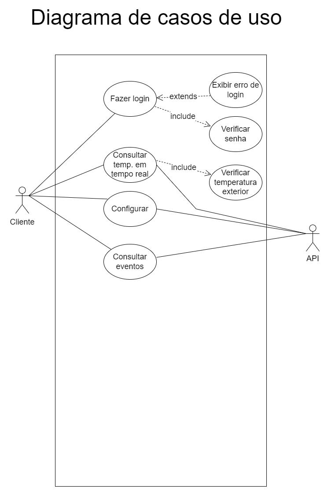
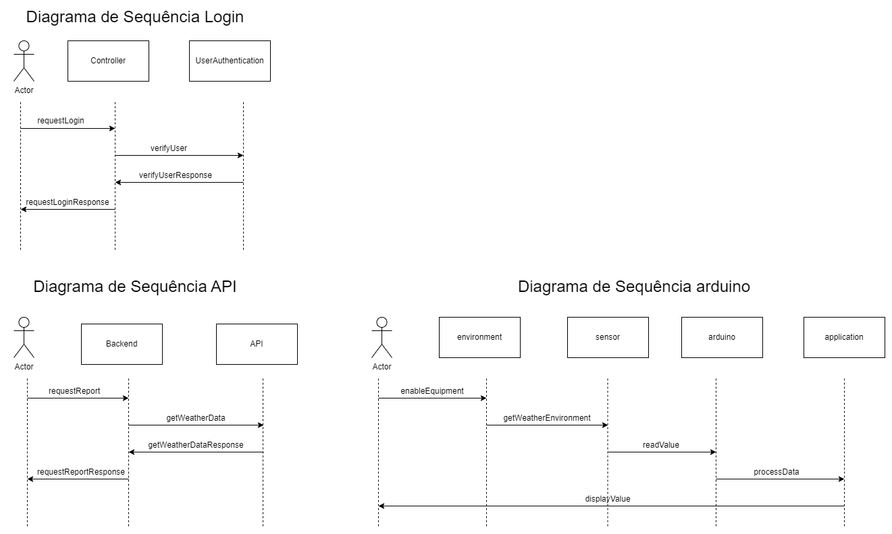
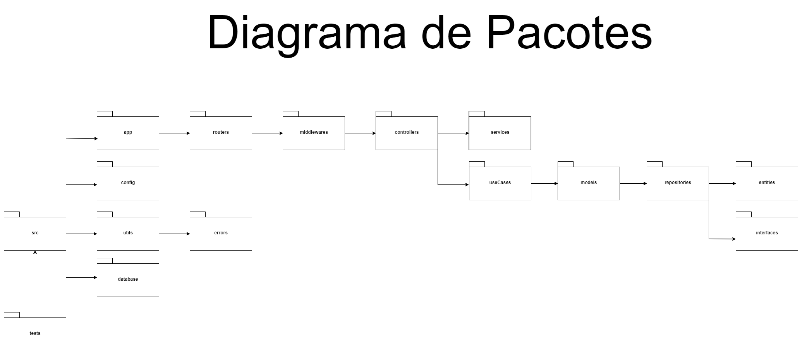

# API TermoSafe

API desenvolvida sobre a plataforma Node.js, com a linguagem Typescript, a aplicação tem como principal finalidade a ingestão de dado, configurações e gerenciamento do dispositivo físico (arduino), entregante os dados para a camada de client
<br>

## Algumas Tecnologias utilizadas

<ul>
  <li><b>Node.js</b> - Runtime para executar javascript no backend.</li>
  <li><b>Typescript</b> - Linguagem de programação que transpila para javascript.</li>
  <li><b>PostgreSQL</b> - SGDB (sistema gerenciador de banco de dados objeto-relacional) open source.</li>
  <li><b>Express</b> - Express.js é um framework para Node.js que fornece recursos mínimos para construção de servidores web.</li>
  <li><b>Sequelize</b> - Sequelize é um ORM(Object/Relational Mapper) baseado em Promise para Node.js.</li>
  <li><b>Axios</b> - Axios é um cliente HTTP baseado em Promises para fazer requisições.</li>
  <li><b>Bcryptjs</b> - Bcrypt é um método de criptografia do tipo hash para senhas baseado no Blowfish.</li>
  <li><b>JsonWebToken (JWT)</b> - JWT é um padrão para autenticação e troca de informações definido pela RFC7519. Nele é possível armazenar de forma segura e compacta objetos JSON.</li>
  <li><b>Cors</b> - Biblioteca que possibilita um mecanismo permitir que recursos restritos da api sejam recuperados por outro domínio fora do domínio (cliente).</li>
  <li><b>Dotenv</b> - DotEnv é um pacote que carrega automaticamente as variáveis de ambiente de um arquivo .env no objeto process.env.</li>
  <li><b>Jest</b> - Biblioteca que facilita a criação e execução de testes em javascript/typescript.</li>
</ul>
<br>

## Instalar e executar aplicação

Execute os seguintes comandos em um terminal:

```
git clone https://github.com/MateusVS/PI-4-DSM-Fatec-Araras.git
```

```
cd PI-4-DSM-Fatec-Araras
```

```
npm install
```

Renomeie o arquivo .env.example para .env e preencha as variáveis de ambiente conforme suas configurações.

Execute o comando:

```
npm start
```

<br>

## API Utilizada

Para comparar os dados obtidos através do dispositivo físico, utilizamos a api <a href="https://openweathermap.org/api">OpenWeatherMap</a> a qual fornece informações climáticas de uma determinada região.
Através dos dados obtidos pela api, o usuário pode comparar com o captado pela api, falicitando a análise dos mesmos, e a identificar se a temperatura externa possa estar influênciando o ambiente onde o dispositivo se encontra.

<br>

## Diagramas

<h3>Diagrama de caso de uso:</h3>


<h3>Diagrama de sequência:</h3>


<h3>Diagrama de pacotes:</h3>

